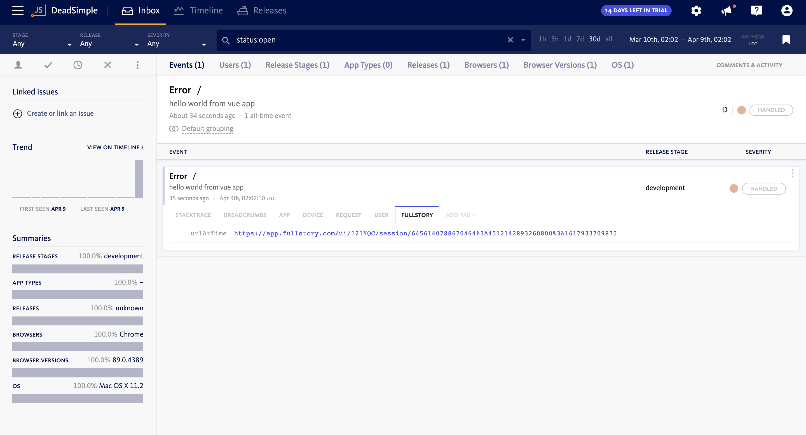
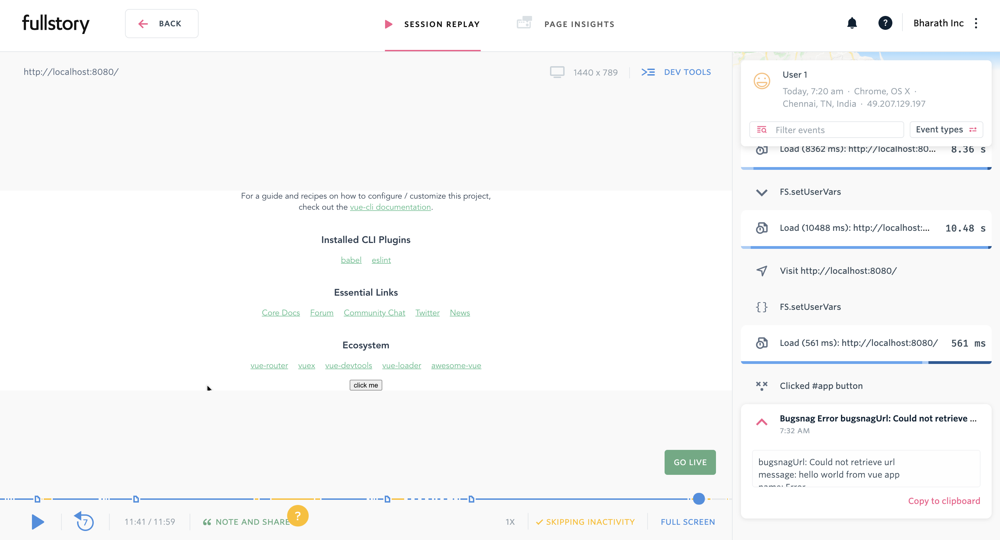

# fullstory-bugsnag

The FullStory-Bugsnag integration seamlessly integrates the FullStorys and Bugsnag platforms. When you look at a browser error in Bugsnag, you will see a link
to the FullStory session replay at that exact moment in time. When you are watching a FullStory replay and your user experiences an error, you will see a custom
error with the basic error details.

## Pre-Requisites

For the FullStory-Bugsnag integration to work, you must have the [FullStory browser SDK package](https://www.npmjs.com/package/@fullstory/browser) and the
[Bugsnag browser SDK package](https://www.npmjs.com/package/@bugsnag/browser).

## Installation

To install the stable version:

with npm:

```
npm install --save @bharathvaj/fullstory-bugsnag
```

with yarn:

```
yarn add @bharathvaj/fullstory-bugsnag
```

## Setup

### Code Changes

To set up the integration, both FullStory and Bugsnag need to be initialized. Please add the following code:

```
import Bugsnag from '@bugsnag/js';
import * as FullStory from '@fullstory/browser';
import BugsnagFullStory from '@bharathvaj/fullstory-bugsnag';

FullStory.init({ orgId: '__FULLSTORY_ORG_ID__' });

Bugsnag.start({
  apiKey: '__YOUR_API_KEY__',
  plugins: [new BugsnagFullStory(options)],
  // ...
});

```

Replace `__YOUR_API_KEY__` with the API found in Project Settings.

You also need to replace `__FULLSTORY_ORG_ID__` with the value of `_fs_org` in the FullStory recording snippet on your
[FullStory settings page](https://help.fullstory.com/hc/en-us/articles/360020623514).

# Roadmap

[ ] - Support Bugsnag Error link in FullStory Custom Event.

[ ] - ~~Register this integration as plugin to bugsnap core library~~

## How it works

In Bugssnag, you should see additional tab called `FULLSTORY` for the error event which will have `urlAtTime`.



In FullStory, you should see an event called `BugSnag Error` on the right sidebar.


